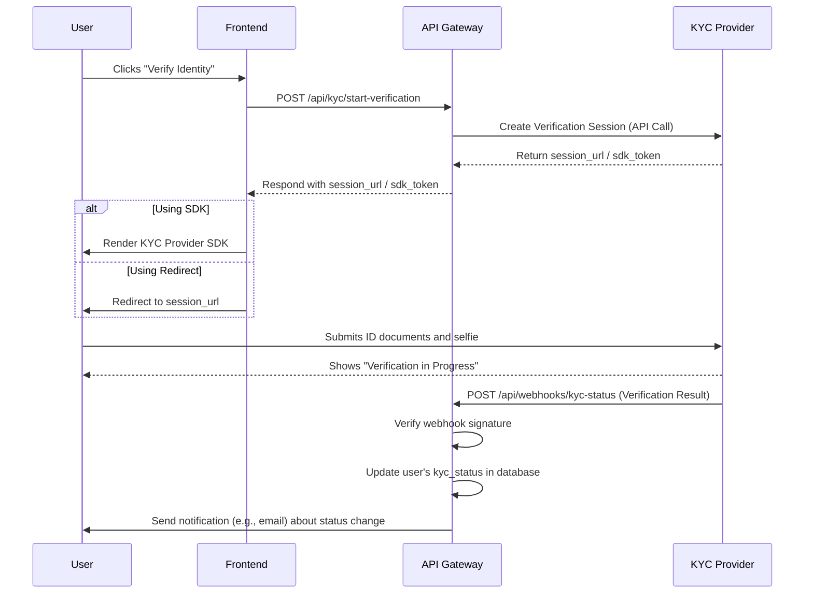

# KYC Integration Flow Design

## 1. Introduction

This document provides a detailed design for the Know Your Customer (KYC) integration flow on the GridTokenX platform. It outlines the sequence of interactions between the user, our frontend, our API gateway, and the third-party KYC provider.

## 2. Actors

- **User**: The individual undergoing identity verification.
- **Frontend**: The React/Vite web application that the user interacts with.
- **API Gateway**: The Rust/Axum backend that orchestrates the process.
- **KYC Provider**: A third-party service like Persona, Veriff, or Onfido that handles the identity verification.

## 3. High-Level Sequence Flow



## 4. Detailed Steps

1.  **Initiation**: The user, logged into their account, navigates to their profile and clicks a "Verify My Identity" button to start the Tier 2 verification process.

2.  **Frontend Request**: The frontend sends an authenticated `POST` request to our `api-gateway` at an endpoint like `/api/kyc/start-verification`.

3.  **Create KYC Session**:
    *   The `api-gateway` receives the request and identifies the `user_id`.
    *   It then makes a server-to-server API call to the chosen KYC provider to create a new verification session.
    *   This request includes a `reference_id` which will be our internal `user_id` so we can map the verification back to the user.

4.  **Receive Session Info**: The KYC provider creates a unique, short-lived verification session and returns a session URL or SDK token to our `api-gateway`.

5.  **Return to Frontend**: The `api-gateway` sends the session URL/token back to the frontend in the response.

6.  **User Verification**:
    *   The frontend uses the received information to either redirect the user to the KYC provider's hosted verification page or render the provider's SDK in a modal.
    *   The user follows the instructions on-screen, which typically involve capturing their government-issued ID and taking a selfie (liveness check).
    *   Once submitted, the user is shown a "verification in progress" message.

7.  **Asynchronous Webhook**:
    *   The KYC provider processes the user's submission in the background. This can take anywhere from a few seconds to several minutes.
    *   When a final decision is reached (`approved`, `rejected`, `needs_review`), the provider sends an HTTP POST request (a webhook) to a pre-configured endpoint on our `api-gateway`, for example, `/api/webhooks/kyc-status`.
    *   The webhook payload contains the `reference_id` (our `user_id`) and the verification result.

8.  **Webhook Handling & Status Update**:
    *   Our `api-gateway` receives the webhook.
    *   **Crucially**, it first verifies the webhook's signature using a secret key to ensure it genuinely came from the KYC provider.
    *   It then parses the payload, extracts the `user_id` and the status, and updates the corresponding user's record in our PostgreSQL database (e.g., setting `kyc_status` to 'verified' or 'rejected').

9.  **User Notification**: After updating the user's status, the `api-gateway` can trigger a notification (e.g., via an email service) to inform the user whether their verification was successful or not. If rejected, the reason should be provided if available and appropriate.

## 5. Database Schema Changes

The `users` table in our PostgreSQL database will need to be updated to track KYC status.

```sql
ALTER TABLE users
ADD COLUMN kyc_status VARCHAR(20) NOT NULL DEFAULT 'not_verified' CHECK (kyc_status IN ('not_verified', 'pending', 'verified', 'rejected')),
ADD COLUMN kyc_provider VARCHAR(50),
ADD COLUMN kyc_session_id VARCHAR(255),
ADD COLUMN kyc_rejection_reason TEXT;

-- Create an index for efficient status lookups
CREATE INDEX idx_users_kyc_status ON users(kyc_status);
```

## 6. Security & Data Privacy

-   **Webhook Security**: The webhook endpoint must be secured by verifying the `X-Signature` (or similar) header sent by the KYC provider. This prevents malicious actors from spoofing verification results.
-   **API Key Management**: The API secret key for the KYC provider must be stored securely (e.g., in environment variables or a secret management service) and never exposed on the client-side.
-   **Data Minimization**: We will not store any raw PII (Personally Identifiable Information) like ID photos or addresses on our servers. We will only store the `status`, `provider`, and a `session_id` for reference. The KYC provider will be responsible for the secure storage of sensitive user data.
-   **Rate Limiting**: The `/api/kyc/start-verification` endpoint should be rate-limited to prevent abuse.
