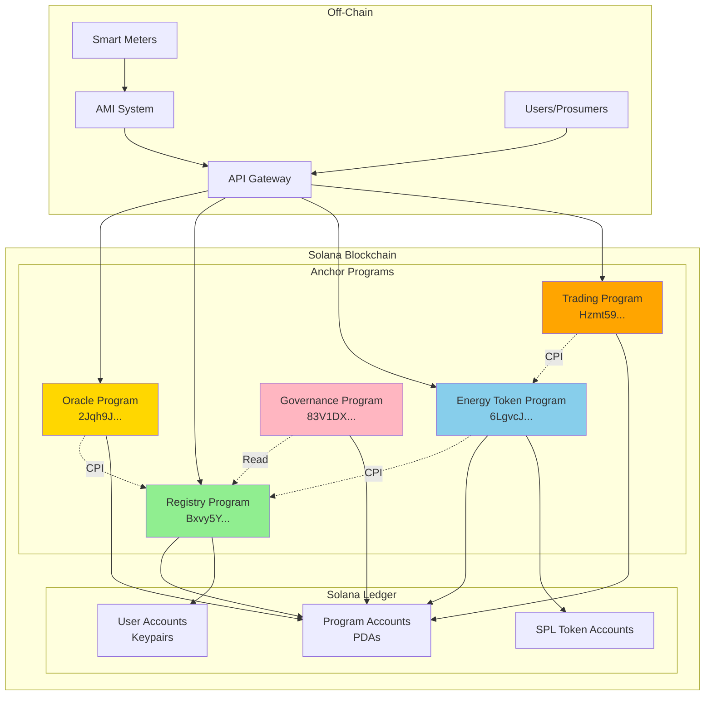
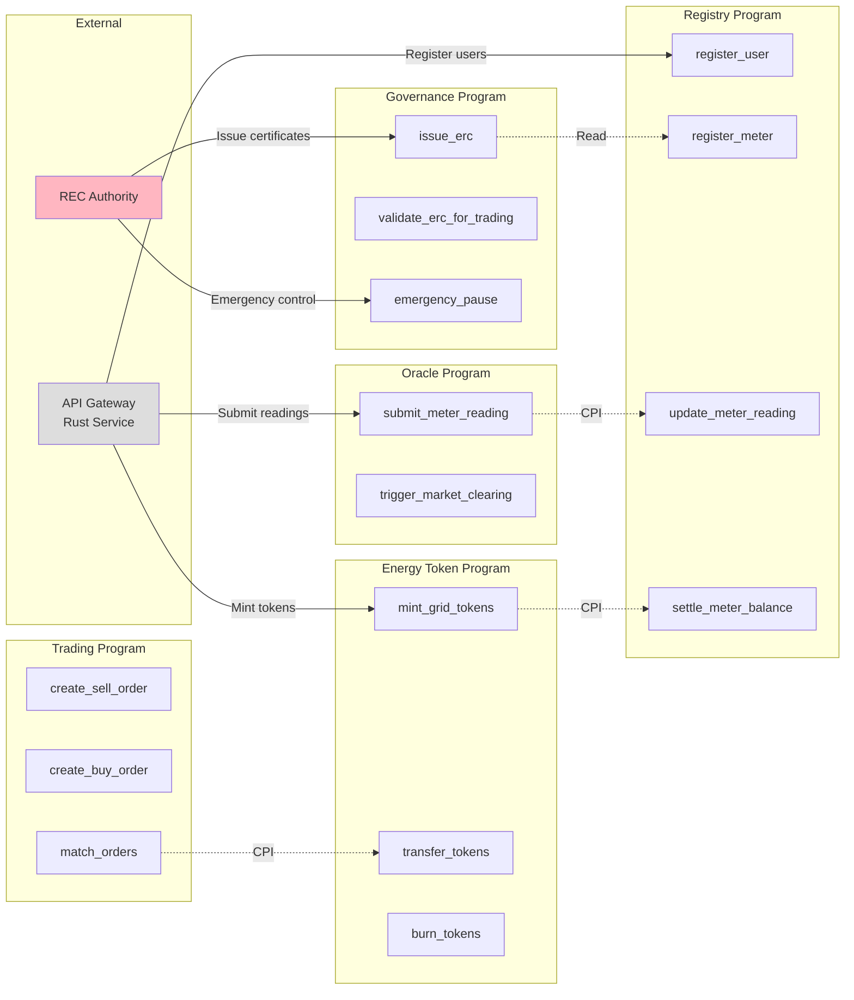
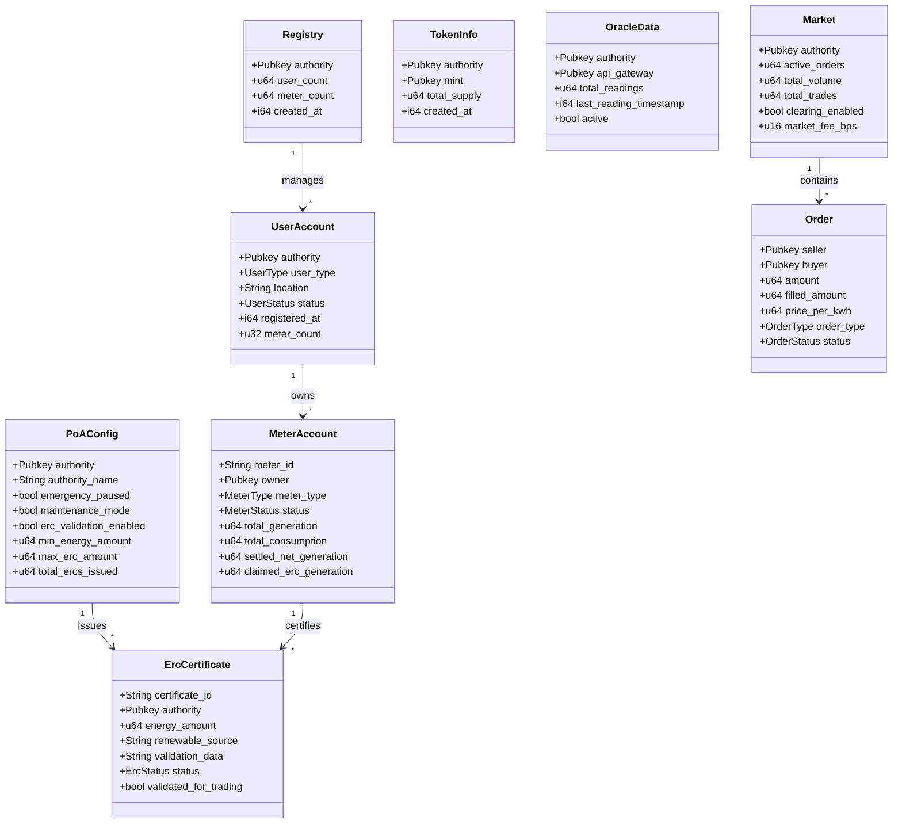
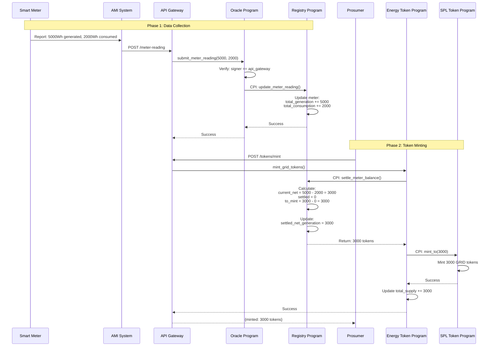
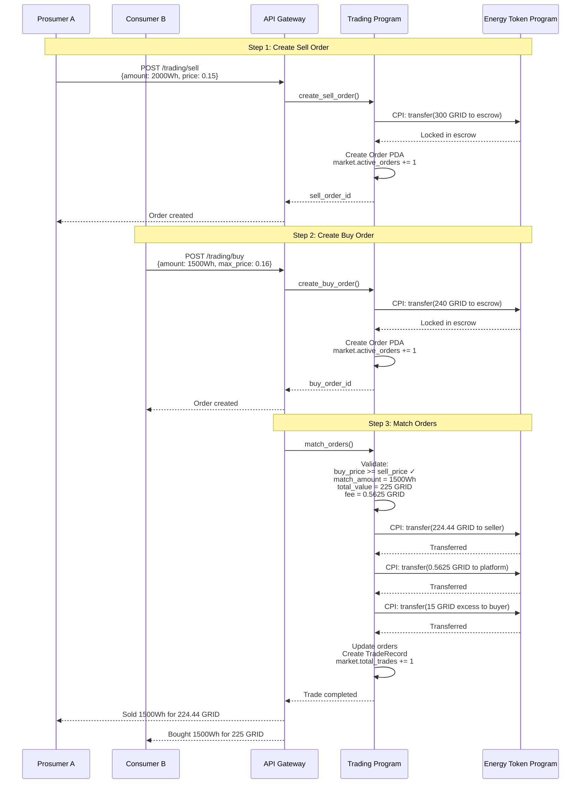
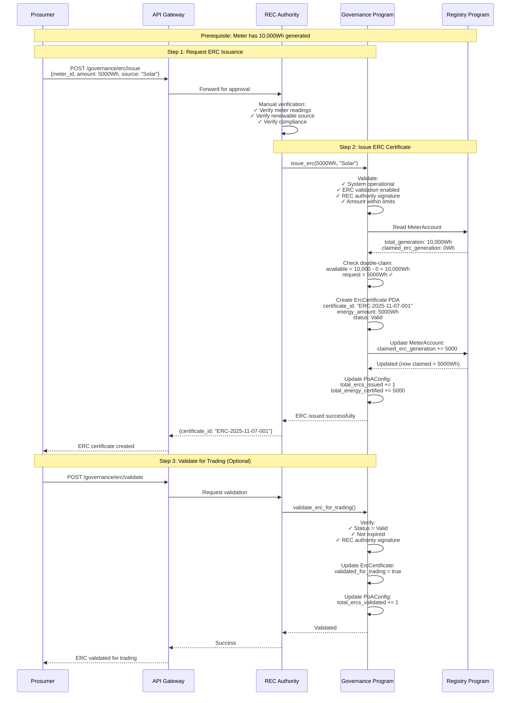
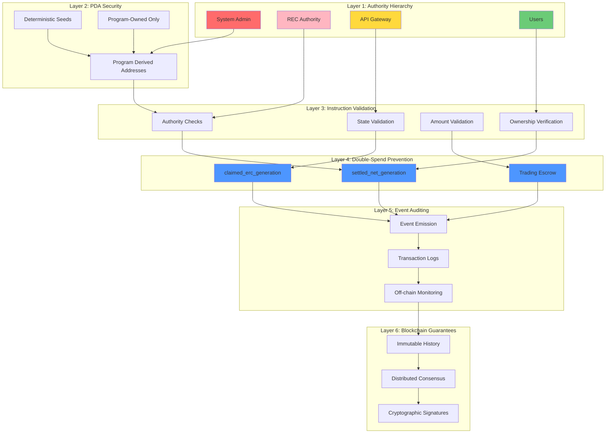
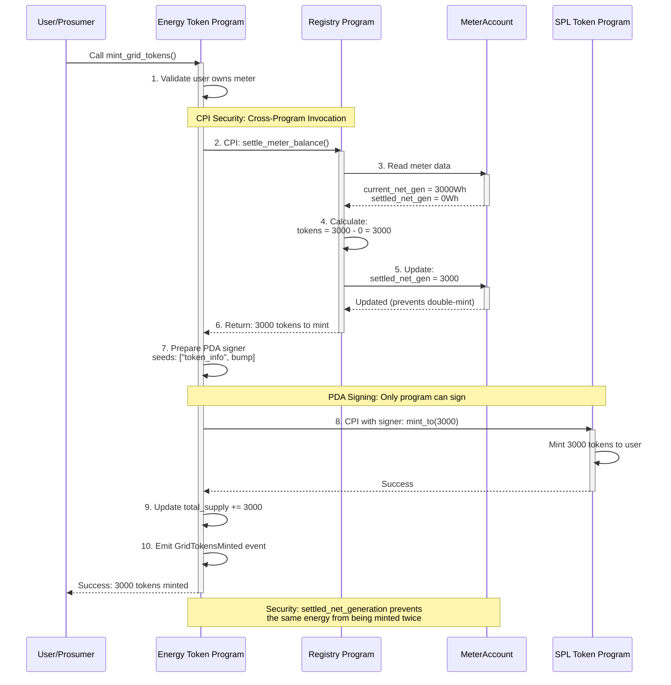

# Anchor Architecture - Mermaid Diagrams

This document contains Mermaid diagrams that render directly in GitHub, VS Code, and many documentation platforms without additional tools.

## Table of Contents

1. [High-Level Architecture](#high-level-architecture)
2. [Program Relationships](#program-relationships)
3. [Account Structure](#account-structure)
4. [Token Minting Flow](#token-minting-flow)
5. [Trading Flow](#trading-flow)
6. [ERC Certification Flow](#erc-certification-flow)

---

## High-Level Architecture



---

## Program Relationships



---

## Account Structure



---

## Token Minting Flow



---

## Trading Flow



---

## ERC Certification Flow



---

## Security Layers



---

## CPI Pattern: Energy Token → Registry



---

## Emergency Controls

```mermaid
stateDiagram-v2
    [*] --> Normal: initialize_poa()
    
    Normal --> EmergencyPaused: emergency_pause()
    Normal --> Maintenance: set_maintenance_mode(true)
    
    EmergencyPaused --> Normal: emergency_unpause()
    Maintenance --> Normal: set_maintenance_mode(false)
    
    state Normal {
        [*] --> Active
        Active --> IssuingERCs: issue_erc()
        IssuingERCs --> ValidatingERCs: validate_erc_for_trading()
        ValidatingERCs --> Active
    }
    
    state EmergencyPaused {
        [*] --> AllOperationsStopped
        note right of AllOperationsStopped
            - No ERC issuance
            - No trading
            - No token minting
            - Only REC Authority can unpause
        end note
    }
    
    state Maintenance {
        [*] --> LimitedOperations
        note right of LimitedOperations
            - Read operations allowed
            - Write operations blocked
            - Configuration updates allowed
        end note
    }
    
    Normal: ✓ All operations allowed
    Normal: ✓ ERC issuance enabled
    Normal: ✓ Trading enabled
    Normal: ✓ Token minting enabled
```

---

**Note:** These Mermaid diagrams render automatically in:
- GitHub README files
- GitLab documentation
- VS Code with Mermaid extension
- Notion
- Many documentation platforms

For PlantUML diagrams with more advanced features, see `ANCHOR_ARCHITECTURE_DIAGRAMS.puml`.
