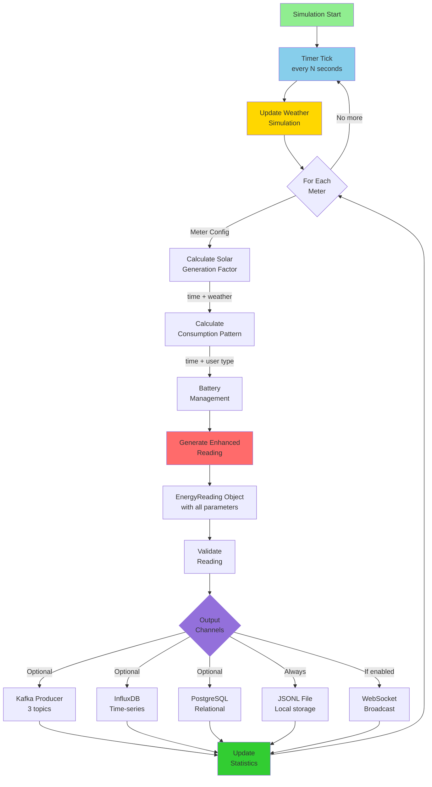
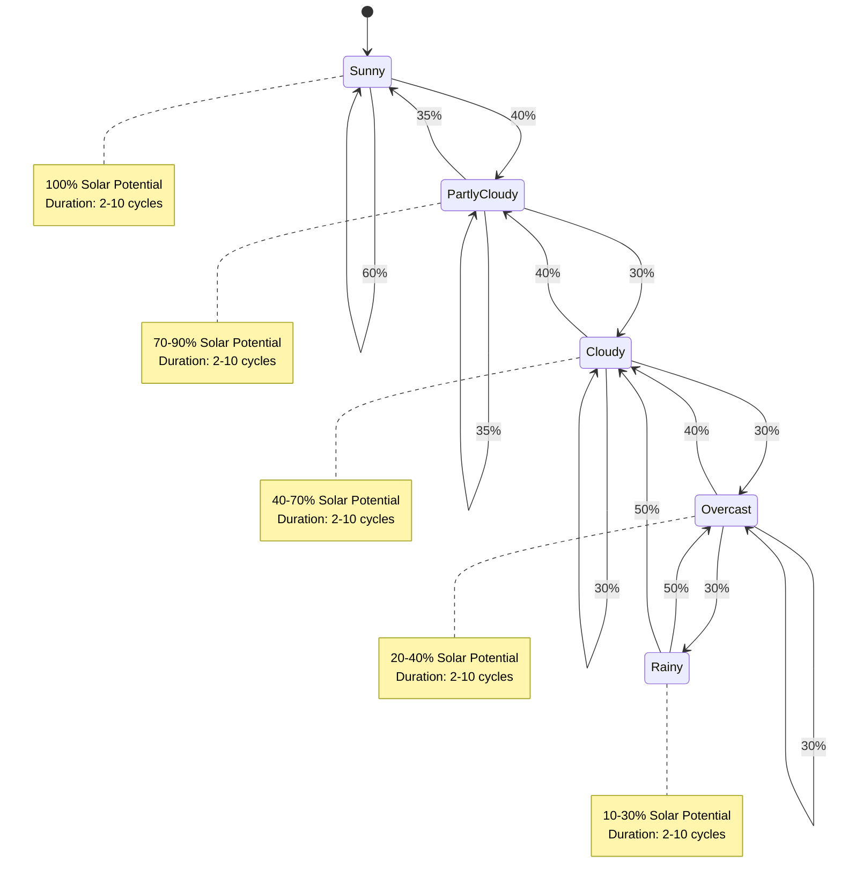
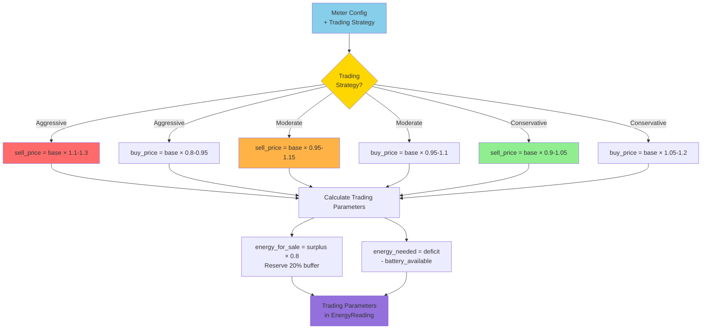
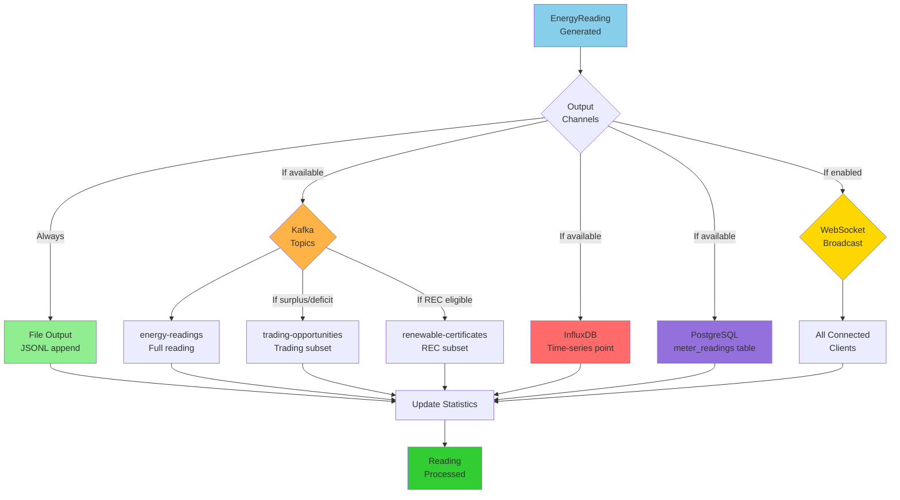
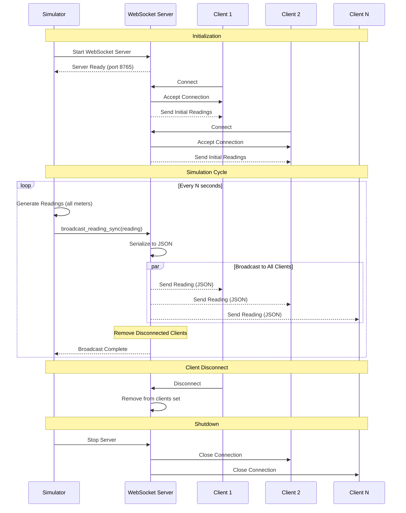
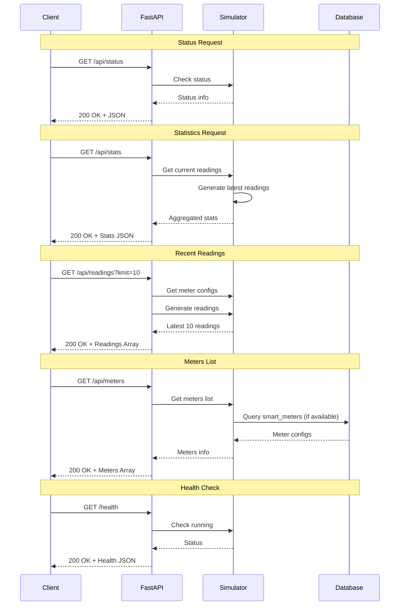
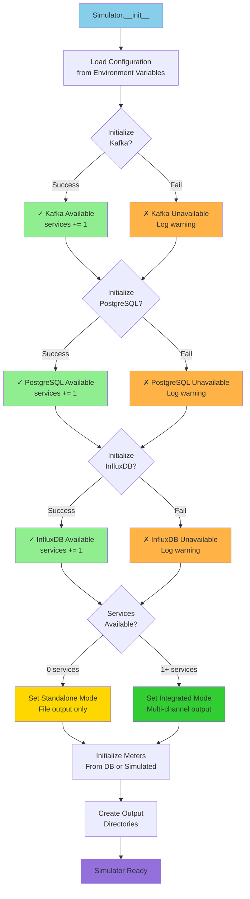

# Smart Meter Simulator - Data Flow Diagrams

## Overview
Visual representation of data flows in the Smart Meter Simulator system.

---

## Simulation Cycle Flow



---

## Weather Simulation State Machine



---

## Solar Generation Calculation Flow

```mermaid
graph LR
    A[Current Time] --> B[Calculate Time Factor<br/>sin²(π×(hour-6)/12)]
    Weather[Weather Condition] --> C[Weather Impact<br/>Sunny: 1.0<br/>Rainy: 0.1-0.3]
    
    B --> D[Calculate Irradiance<br/>time × weather × 1200 W/m²]
    C --> D
    
    D --> E[Panel Temperature<br/>ambient + irradiance/1000 × 25]
    
    E --> F[Temperature Derating<br/>1 + (-0.004)×(temp-25)]
    
    Config[Meter Config] --> G[Base Generation<br/>capacity × efficiency]
    
    G --> H[Final Generation]
    F --> H
    D --> H
    
    H --> I[energy_generated<br/>+ noise]
    
    style A fill:#87CEEB
    style Weather fill:#FFD700
    style Config fill:#90EE90
    style I fill:#FF6B6B
```

---

## Battery Management Flow

```mermaid
graph TB
    Start[Calculate Net Energy<br/>generation - consumption] --> Check{Net Energy?}
    
    Check -->|Positive<br/>Excess| Charge[Charge Battery]
    Check -->|Negative<br/>Deficit| CheckBattery{Battery Level<br/>> 10%?}
    Check -->|Zero| NoAction[No Battery Action]
    
    Charge --> CalcCharge[charge_amount = min(<br/>net_energy × efficiency,<br/>(100-level)/100 × capacity)]
    CalcCharge --> UpdateLevel1[level += charge_amount/capacity × 100]
    UpdateLevel1 --> Surplus[surplus_energy = net_energy - charge_amount]
    
    CheckBattery -->|Yes| Discharge[Discharge Battery]
    CheckBattery -->|No| GridDeficit[deficit_energy = abs(net_energy)]
    
    Discharge --> CalcDischarge[discharge_amount = min(<br/>abs(net_energy),<br/>level/100 × capacity)]
    CalcDischarge --> UpdateLevel2[level -= discharge_amount/capacity × 100]
    UpdateLevel2 --> AddGen[generation += discharge_amount]
    AddGen --> CalcDeficit[deficit = abs(net_energy) - discharge_amount]
    
    Surplus --> Done[Battery Update Complete]
    GridDeficit --> Done
    CalcDeficit --> Done
    NoAction --> Done
    
    style Start fill:#87CEEB
    style Charge fill:#90EE90
    style Discharge fill:#FFB347
    style Done fill:#9370DB
```

---

## Trading Price Calculation Flow



---

## Multi-Channel Output Flow



---

## Consumption Pattern Flow

```mermaid
graph TB
    Start[Current Hour<br/>+ Meter Config] --> UserType{User<br/>Type?}
    
    UserType -->|Consumer| ConsPeak{Time?}
    ConsPeak -->|6-9 AM<br/>5-10 PM| C1[factor = 1.4-2.0]
    ConsPeak -->|10 PM - 6 AM| C2[factor = 0.3-0.7]
    ConsPeak -->|9 AM - 5 PM| C3[factor = 0.7-1.1]
    
    UserType -->|Prosumer| ProsPeak{Time?}
    ProsPeak -->|10 AM - 3 PM<br/>Solar Peak| P1[factor = 0.6-0.9<br/>Shifted usage]
    ProsPeak -->|7-9 AM<br/>6-9 PM| P2[factor = 1.2-1.6]
    ProsPeak -->|Other| P3[factor = 0.8-1.2]
    
    UserType -->|Storage Provider| StorPeak{Time?}
    StorPeak -->|8 AM - 5 PM| S1[factor = 1.1-1.4]
    StorPeak -->|Off-hours| S2[factor = 0.7-1.0]
    
    C1 --> Calc[consumption = base × factor × gaussian(1.0, variability)]
    C2 --> Calc
    C3 --> Calc
    P1 --> Calc
    P2 --> Calc
    P3 --> Calc
    S1 --> Calc
    S2 --> Calc
    
    Calc --> Output[energy_consumed<br/>in reading]
    
    style Start fill:#87CEEB
    style UserType fill:#FFD700
    style Calc fill:#FF6B6B
    style Output fill:#9370DB
```

---

## WebSocket Real-time Broadcasting



---

## FastAPI REST API Flow



---

## Service Initialization Flow



---

## Data Flow Summary

### Input Sources
1. **Configuration**: Environment variables
2. **Time**: System clock for time-based calculations
3. **Randomness**: Weather transitions, noise factors
4. **Database** (optional): Meter configurations

### Processing Stages
1. **Weather Simulation**: Dynamic weather state machine
2. **Solar Generation**: Physics-based calculation
3. **Consumption Pattern**: Time-of-day + user type
4. **Battery Management**: Charge/discharge logic
5. **Trading Calculation**: Strategy-based pricing
6. **REC Validation**: Eligibility determination

### Output Channels
1. **File**: Always active (JSONL format)
2. **Kafka**: 3 topics (readings, trading, REC)
3. **InfluxDB**: Time-series optimization
4. **PostgreSQL**: Relational storage
5. **WebSocket**: Real-time broadcasting

### Feedback Loops
- Weather state persists across cycles
- Battery level carries over between readings
- Statistics accumulate over time

---

**Document Version**: 1.0.0  
**Last Updated**: 2025-11-09  
**Related**: [Smart Meter Simulator Technical Documentation](../../architecture/system/SMART_METER_SIMULATOR.md)
